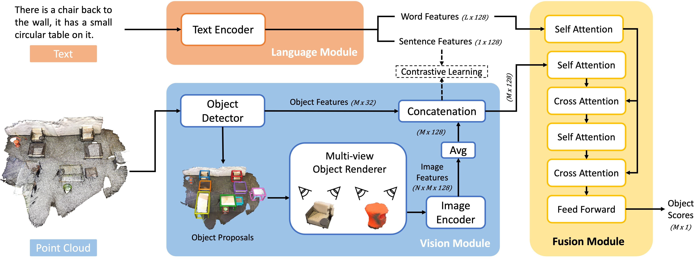

# M3DRef-CLIP

<a href="https://pytorch.org/"></a>
<a href="https://pytorchlightning.ai/"></a>
<a href="https://wandb.ai/site"></a>

This is the official implementation for [Multi3DRefer: Grounding Text Description to Multiple 3D Objects](https://3dlg-hcvc.github.io/multi3drefer/).



## Requirement
This repo contains [CUDA](https://developer.nvidia.com/cuda-zone) implementation, please make sure your [GPU compute capability](https://developer.nvidia.com/cuda-gpus) is at least 3.0 or above.

We report the max computing resources usage with batch size 4:

|               | Training | Inference |
|:--------------|:---------|:----------|
| GPU mem usage | 15.2 GB  | 11.3 GB   |


## Setup
### Conda (recommended)
We recommend the use of [miniconda](https://docs.conda.io/en/latest/miniconda.html) to manage system dependencies.

```shell
# create and activate the conda environment
conda create -n m3drefclip python=3.10
conda activate m3drefclip

# install PyTorch 2.0.1
conda install pytorch torchvision pytorch-cuda=11.7 -c pytorch -c nvidia

# install PyTorch3D with dependencies
conda install -c fvcore -c iopath -c conda-forge fvcore iopath
conda install pytorch3d -c pytorch3d

# install MinkowskiEngine with dependencies
conda install -c anaconda openblas
pip install -U git+https://github.com/NVIDIA/MinkowskiEngine -v --no-deps \
--install-option="--blas_include_dirs=${CONDA_PREFIX}/include" --install-option="--blas=openblas"

# install Python libraries
pip install .

# install CUDA extensions
cd m3drefclip/common_ops
pip install .
```

### Pip
Note: Setting up with pip (no conda) requires [OpenBLAS](https://github.com/xianyi/OpenBLAS) to be pre-installed in your system.
```shell
# create and activate the virtual environment
virtualenv env
source env/bin/activate

# install PyTorch 2.0.1
pip install torch torchvision

# install PyTorch3D
pip install pytorch3d

# install MinkowskiEngine
pip install MinkowskiEngine

# install Python libraries
pip install .

# install CUDA extensions
cd m3drefclip/common_ops
pip install .
```

## Data Preparation
Note: Both [ScanRefer](https://daveredrum.github.io/ScanRefer/) and [Nr3D](https://referit3d.github.io/) datasets requires the [ScanNet v2](http://www.scan-net.org/) dataset. Please preprocess it first.

### ScanNet v2 dataset
1. Download the [ScanNet v2 dataset (train/val/test)](http://www.scan-net.org/), (refer to [ScanNet's instruction](dataset/scannetv2/README.md) for more details). The raw dataset files should be organized as follows:
    ```shell
    m3drefclip # project root
    ├── dataset
    │   ├── scannetv2
    │   │   ├── scans
    │   │   │   ├── [scene_id]
    │   │   │   │   ├── [scene_id]_vh_clean_2.ply
    │   │   │   │   ├── [scene_id]_vh_clean_2.0.010000.segs.json
    │   │   │   │   ├── [scene_id].aggregation.json
    │   │   │   │   ├── [scene_id].txt
    ```

2. Pre-process the data, it converts original meshes and annotations to `.pth` data:
    ```shell
    python dataset/scannetv2/preprocess_all_data.py data=scannetv2 +workers={cpu_count}
    ```

3. Pre-process the multiview features from ENet: Please refer to the instructions in [ScanRefer's repo](https://github.com/daveredrum/ScanRefer#data-preparation) with one modification:
   - comment out lines 51 to 56 in [batch_load_scannet_data.py](https://github.com/daveredrum/ScanRefer/blob/master/data/scannet/batch_load_scannet_data.py#L51-L56) since we follow D3Net's setting that doesn't do point downsampling here.

   Then put the generated `enet_feats_maxpool.hdf5` (116GB) under `m3drefclip/dataset/scannetv2`

### ScanRefer dataset
1. Download the [ScanRefer dataset (train/val)](https://daveredrum.github.io/ScanRefer/). Also, download the [test set](http://kaldir.vc.in.tum.de/scanrefer_benchmark_data.zip). The raw dataset files should be organized as follows:
    ```shell
    m3drefclip # project root
    ├── dataset
    │   ├── scanrefer
    │   │   ├── metadata
    │   │   │   ├── ScanRefer_filtered_train.json
    │   │   │   ├── ScanRefer_filtered_val.json
    │   │   │   ├── ScanRefer_filtered_test.json
    ```

2. Pre-process the data, "unique/multiple" labels will be added to raw `.json` files for evaluation purpose:
    ```shell
    python dataset/scanrefer/add_evaluation_labels.py data=scanrefer
    ```

### Nr3D dataset
1. Download the [Nr3D dataset (train/test)](https://referit3d.github.io/benchmarks.html). The raw dataset files should be organized as follows:
    ```shell
    m3drefclip # project root
    ├── dataset
    │   ├── nr3d
    │   │   ├── metadata
    │   │   │   ├── nr3d_train.csv
    │   │   │   ├── nr3d_test.csv
    ```

2. Pre-process the data, "easy/hard/view-dep/view-indep" labels will be added to raw `.csv` files for evaluation purpose:
    ```shell
    python dataset/nr3d/add_evaluation_labels.py data=nr3d
    ```

### Multi3DRefer dataset
1. Downloading the [Multi3DRefer dataset (train/val)](https://aspis.cmpt.sfu.ca/projects/multi3drefer/data/multi3drefer_train_val.zip). The raw dataset files should be organized as follows:
    ```shell
    m3drefclip # project root
    ├── dataset
    │   ├── multi3drefer
    │   │   ├── metadata
    │   │   │   ├── multi3drefer_train.json
    │   │   │   ├── multi3drefer_val.json
    ```

### Pre-trained detector
We pre-trained [PointGroup](https://arxiv.org/abs/2004.01658) implemented in [MINSU3D](https://github.com/3dlg-hcvc/minsu3d/) on [ScanNet v2](http://www.scan-net.org/) and use it as the detector. We use coordinates + colors + multi-view features as inputs.
1. Download the [pre-trained detector](https://aspis.cmpt.sfu.ca/projects/m3dref-clip/pretrain/PointGroup_ScanNet.ckpt). The detector checkpoint file should be organized as follows:
    ```shell
    m3drefclip # project root
    ├── checkpoints
    │   ├── PointGroup_ScanNet.ckpt
    ```

## Training, Inference and Evaluation
Note: Configuration files are managed by [Hydra](https://hydra.cc/), you can easily add or override any configuration attributes by passing them as arguments.
```shell
# log in to WandB
wandb login

# train a model with the pre-trained detector, using predicted object proposals
python train.py data={scanrefer/nr3d/multi3drefer} experiment_name={any_string} +detector_path=checkpoints/PointGroup_ScanNet.ckpt

# train a model with the pretrained detector, using GT object proposals
python train.py data={scanrefer/nr3d/multi3drefer} experiment_name={any_string} +detector_path=checkpoints/PointGroup_ScanNet.ckpt model.network.detector.use_gt_proposal=True

# train a model from a checkpoint, it restores all hyperparameters in the .ckpt file
python train.py data={scanrefer/nr3d/multi3drefer} experiment_name={checkpoint_experiment_name} ckpt_path={ckpt_file_path}

# test a model from a checkpoint and save its predictions
python test.py data={scanrefer/nr3d/multi3drefer} data.inference.split={train/val/test} ckpt_path={ckpt_file_path} pred_path={predictions_path}

# evaluate predictions
python evaluate.py data={scanrefer/nr3d/multi3drefer} pred_path={predictions_path} data.evaluation.split={train/val/test}
```
## Checkpoints
### ScanRefer dataset
[M3DRef-CLIP_ScanRefer.ckpt](https://aspis.cmpt.sfu.ca/projects/m3dref-clip/pretrain/M3DRef-CLIP_ScanRefer.ckpt)

Performance:

| Split | IoU  | Unique | Multiple | Overall | 
|:------|:-----|:-------|:---------|:--------|
| Val   | 0.25 | 85.3   | 43.8     | 51.9    |
| Val   | 0.5  | 77.2   | 36.8     | 44.7    |
| Test  | 0.25 | 79.8   | 46.9     | 54.3    |
| Test  | 0.5  | 70.9   | 38.1     | 45.5    |

### Nr3D dataset
[M3DRef-CLIP_Nr3d.ckpt](https://aspis.cmpt.sfu.ca/projects/m3dref-clip/pretrain/M3DRef-CLIP_Nr3D.ckpt)

Performance:

| Split | Easy | Hard | View-dep | View-indep | Overall |
|:------|:-----|:-----|:---------|:-----------|:--------|
| Test  | 55.6 | 43.4 | 42.3     | 52.9       | 49.4    |

### Multi3DRefer dataset
[M3DRef-CLIP_Multi3DRefer.ckpt](https://aspis.cmpt.sfu.ca/projects/m3dref-clip/pretrain/M3DRef-CLIP_Multi3DRefer.ckpt)

Performance:

| Split | IoU  | ZT w/ D | ZT w/o D | ST w/ D | ST w/o D | MT   | Overall |
|:------|:-----|:--------|:---------|:--------|:---------|:-----|:--------|
| Val   | 0.25 | 39.4   | 81.8     | 34.6    | 53.5     | 43.6 | 42.8    |
| Val   | 0.5  | 39.4   | 81.8     | 30.6    | 47.8     | 37.9 | 38.4    |
     

## Benchmark
### ScanRefer
Convert M3DRef-CLIP predictions to [ScanRefer benchmark format](https://kaldir.vc.in.tum.de/scanrefer_benchmark/documentation):
```shell
python dataset/scanrefer/convert_output_to_benchmark_format.py data=scanrefer pred_path={predictions_path} +output_path={output_file_path}
```
### Nr3D
Please refer to [ReferIt3D benchmark](https://referit3d.github.io/benchmarks.html) to report results.
